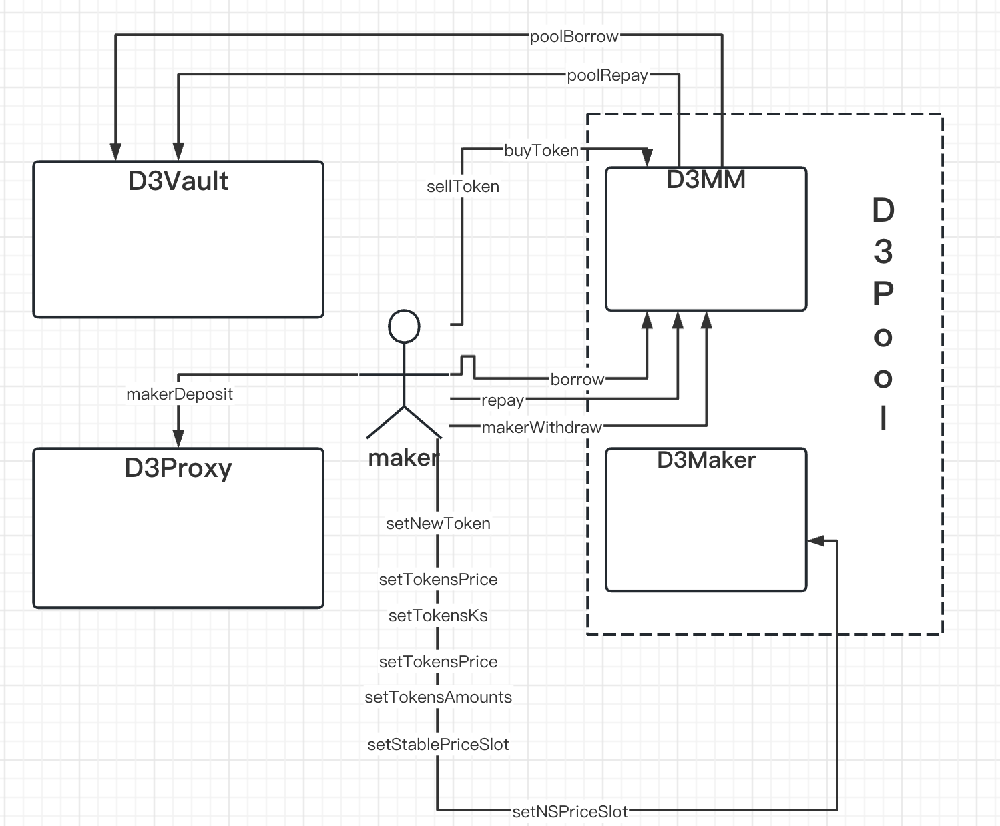
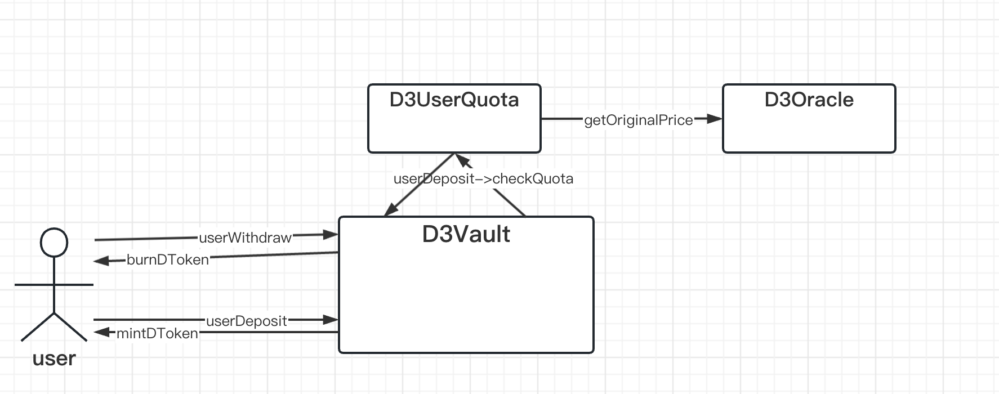
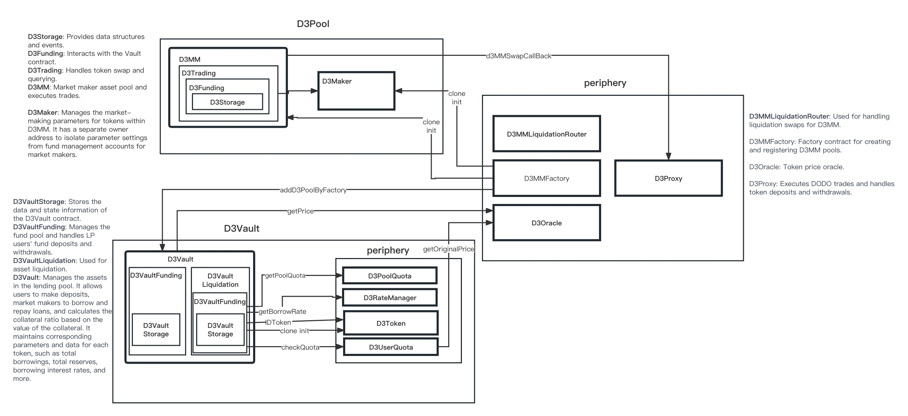

# DODO V3

## Overview

What is DODO V3?

For market makers, DODO V3 can offer:

- leveraged market making pool
- multi-assets pool
- flexible market-making strategies

For LPs, DODO V3 offers:

- higher than market interest returns
- no impermanent loss

For traders, DODO V3 offers:

- better liquidity

The DODO V3 smart contract system is composed of three parts: D3Pool, D3Vault, and periphery.

The D3Vault contract is responsible for handling user deposits and withdrawals of digital assets, providing liquidation services to debtors, and offering borrowing and repayment functionality to the market-making pool. It is one of the core contracts of DODO V3. Additionally, there are auxiliary contracts associated with D3Vault that assist in calculating user deposit limits, pool borrowing limits, borrowing interest rates, and other related functionalities.

The D3MM contract is responsible for market makers' deposits and withdrawals of relevant assets, initiating borrowing and repayment operations with D3Vault, executing digital asset exchanges, and performing other important functionalities. It is also one of the core contracts of DODO V3.

D3Maker is an integral part of the D3MM contract and is responsible for setting various parameter values and retrieving related parameters.

The Periphery includes four contracts: D3MMFactory, D3MMLiquidationRouter, D3Oracle, and D3Proxy. These contracts are respectively used for creating the factory contract for D3MM, the liquidation routing contract for D3MM, the price oracle contract for DODO V3, and the proxy contract for DODO V3.

Periphery contracts interact with D3Vault, multiple D3MM, and other contracts but are not considered part of the core. These contracts enhance user safety and clarity by providing alternative methods to access the core and supplying necessary external data to the core. They are separate from the core contracts, allowing for upgradability and replacement, making the entire contract architecture loosely coupled and flexible.







### D3Vault

D3Vault provides a fund pool for market makers in DODO V3, maximizing capital utilization. Liquidity providers (LPs) can deposit assets into this contract to earn interest. The D3Vault contract inherits three contracts:

D3VaultStorage: Stores the contract's data and state information.

D3VaultFunding: Manages the fund pool and LP users' fund deposits and withdrawals.

D3VaultLiquidation: Handles the liquidation of assets.

The attachments to D3Vault include four contracts:

D3PoolQuota: Responsible for pool quota management.

D3RateManager: Manages borrowing rates.

D3Token: Deposit proof token.

D3UserQuota: Manages user quotas.

### D3Pool is divided into D3MM contracts and D3Maker contracts.

D3MM contracts inherit three contracts:

D3Storage: Provides data structures and events.

D3Funding: Interacts with the Vault contract.

D3Trading: Handles token swap and querying.

The D3Maker contract is responsible for managing the market-making parameters for tokens within D3MM. It has a separate owner address to isolate the parameter settings account from the fund management account for market makers.

### The Periphery contracts consist of four contracts:

D3MMLiquidationRouter: Handles the liquidation swap for D3MM.

D3MMFactory: Factory contract for creating and registering D3MM pools.

D3Oracle: Token price oracle.

D3Proxy: Executes DODO trades and handles token deposits and withdrawals.

## Project Setup

### Install Foundry

First run the command below to get `foundryup`, the Foundry toolchain installer:

```
curl -L https://foundry.paradigm.xyz | bash

```

If you do not want to use the redirect, feel free to manually download the foundryup installation script from [here](https://raw.githubusercontent.com/gakonst/foundry/master/foundryup/install).

Then, in a new terminal session or after reloading your `PATH`, run it to get the latest `forge` and `cast` binaries:

```
foundryup

```

Advanced ways to use `foundryup`, and other documentation, can be found in the [foundryup package](https://file+.vscode-resource.vscode-cdn.net/Users/zuocong/Documents/code/dodoContracts/new-dodo-v3/foundryup/README.md). Happy forging!

### Install Hardhat And Packages

```
yarn

```

## Commands

```
Scripts available via `npm run-script`:
  compile
    npx hardhat compile
  deploy
    npx hardhat deploy --network goerli
  verify
    npx hardhat verify

```

```
Foundry Commands
  unit tests
    forge test
  coverage
    forge coverage

```

## Adding dependency

Prefer `npm` packages when available and update the remappings.

### Example

install: `yarn add -D @openzeppelin/contracts`

remapping: `@openzeppelin/contracts=node_modules/@openzeppelin/contracts`

import: `import "@openzeppelin/contracts/token/ERC20/ERC20.sol";`

## Audit
DODO V3 has been audited by [Sherlock](https://audits.sherlock.xyz/contests/89). The [sherlock-audit](https://github.com/DODOEX/dodo-v3/tree/sherlock-audit) branch is the final audited version.
